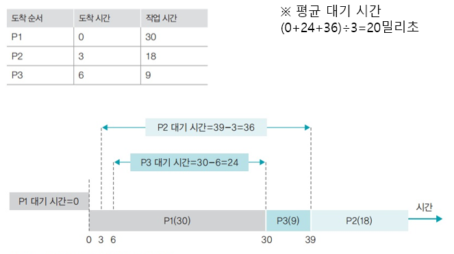

# Ch.1 운영체제의 개요

## 일반적인 운영체제의 정의
- 일반 컴퓨터, 노트북, 스마트폰의 전원을 켜면 가장 먼저 만나게 되는 소프트웨어
- 응용 프로그램이나 사용자에게 컴퓨터 자원을 사용할 수 있는 인터페이스를 제공하고 그 결과를 돌려주는 시스템 소프트웨어
- 응용 프로그램이나 사용자에게 모든 컴퓨터 자원을 숨기고 정해진 방법으로만 컴퓨터 자원을 사용할 수 있도록 제한

## 임베디드 운영체제
- CPU의 성능이 낮고 메모리 크기도 작은 시스템에 내장하도록 만든 운영체제
- 임베디드 운영체제가 있는 기계는 기능을 계속 향상할 수 있음

## 운영체제의 필요성
- 컴퓨터는 운영체제가 없어도 작동하지만 기능에 제약이 따른다
- 운영체제가 있는 기계는 다양한 응용프로그램을 설치하여 사용할 수 있고 성능 향상을 위한 새로운 기능을 쉽게 추가할 수 있다.
- 운영체제는 컴퓨터의 성능을 향상할 뿐 아니라 자원을 관리하고 사용자에게 편리한 인터페이스 환경을 제공한다
- 운영체제는 사용자가 직접 자원에 접근하는 것을 막음으로써 컴퓨터 자원을 보호한다
- 운영체제가 제공하는 사용자 인터페이스와 하드웨어 인터페이스를 이용하여 숨어 있는 자원에 접근한다.

## 운영체제의 목표
- 자원 관리 : 효율성
- 자원 보호 : 안정성
- 하드웨어 인터페이스 제공 : 확장성
- 사용자 인터페이스 제공 : 편리성

## 시스템의 흐름

### 1. 에니악
- 진공관이라는 소자를 사용하여 진공광이 켜지면 1, 꺼지면 0 이라고 판단
- 운영체제가 없음

### 2. 천공카드 시스템
- 천공카드 리더를 입력장치로, 라인 프린터(한 줄)을 출력장치로 사용
- 프로그램을 구성한 후 카드에 구멍을 뚫어 컴퓨터에 입력하면 프로그램이 실행되는 구조로서 프로그램의 실행결과가 라인 프린터를 통해 출력

### 3. 일괄 작업 시스템
- 천공카드리더기(입력)와 라인프린터(출력) 사용 : 모든 작업을 한꺼번에 처리하고 프로그램 실행 중간에 사용자가 데이터를 입력하거나 수정하는 것이 불가능한 시스템 / 한 번에 시스템이 적용
- 운영체제 사용(메인 메모리가 운영체제의 상주 영역과 사용자의 영역으로 나뉨)

### 4. 대화형 시스템
- 모니터와 키보드의 등장 : 프로그램이 진행되는 도중에 사용자로부터 입력을 받을 수 있어 입력 값에 다라 작업의 흐름을 바꾸는 것이 가능한 시스템
- 대화형 시스템의 등장으로 문서 편집기, 게임과 같은 다양한 종류의 응용 프로그램을 만들 수 있게 됨

### 5. 다중 프로그래밍
- 하나의 CPU로 여러 작업을 동시에 실행하는 기술
- 한 번에 하나의 작업만 가능한 일괄 작업 시스템에 비해 효율성이 뛰어남
- 시간을 분할하는 방법 때문에 여러 작업이 동시에 실행되는 것처럼 보임

### 6. 분산 시스템
- 개인용 컴퓨터와 인터넷이 보급되면서 값이 싸고 크기가 작은 컴퓨터를 하나로 묶어서 대형 컴퓨터의 능력에 버금가는 시스템을 만들 수 있게 됨
- 네트워크 상에 분산되어 있는 여러 컴퓨터로 작업을 처리하고 그 결과를 상호 교환하도록 구성한 시스템

### 7. 클라이언트/서버 시스템
- 작업을 요청하는 클라이언트와 거기에 응답하여 요청 받은 작업을 처리하는 서버의 이중구조로 나뉨
- 웹 시스템이 보급된 이후 일반인들에게 알려짐

### 8. P2P 시스템
- 클라이언트/서버 구조의 단점인 서버 과부화를 해결하기 위해 만든 시스템
- 서버를 거치지 않고 사용자와 사용자를 직접 연결
- 냅스터(mp3 공유 시스템)에서 시작하여 현재는 메신저나 토렌트 시스템에서 사용

### 9. 그리드 시스템
- 필요한 기간 만큼만 컴퓨터를 사용하고 사용한 금액 만큼만 돈을 지불할 수 있는 컴퓨팅 환경
- 서로 다른 기종의 컴퓨터들을 묶어 대용량의 컴퓨터 풀을 구성하고 이를 원격지와 연결하여 대용량 연산을 수행하는 컴퓨팅 환경
- 그리드가 하드웨어적인 컴퓨팅 환경의 통합이라고 한다면 Saas는 사용자가 필요한 소프트웨어 기능만을 필요할 때 이용하고, 이용한 기능만큼만 비용을 지불하는 개념

### 10. 클라우드 컴퓨팅
- 클라우드 컴퓨팅은 PC, 핸드폰, 스마트폰 기기 등을 통하여 인터넷에 접속하고, 다양한 작업으 ㄹ수행하며, 데이터 똫나 기기들 사이에서 자유롭게 이동이 가능한 컴퓨팅 환경
- 하드웨어를 포함한 시스템이 구름에 가려진 것처럼 사용자에게 보이지 않는 컴퓨팅 환경이라는 의미

### 11. IoT
- 사물에 센서와 통신 기능을 내장하여 인터넷에 연결하는 기술
- 인터넷으로 연결된 사물들이 데이터를 주고받아 스스로 분석하고 학습한 정보를 사용자에게 제공하거나 새로운 서비스를 창출

## 커널
- 프로세스 관리, 메모리 관리, 저장장치 관리와 같은 운영체제의 핵심적인 기능을 모아놓은 것

## 인터페이스
- 커널에 사용자의 명령을 전달하고 실행 결과를 사용자에게 알려주는 역할
- 그래픽을 사용한 인터페이스를 GUI라 부름

## 커널의 역할
- 프로세서 관리 : 프로세스에 CPU를 배분하고 작업에 필요한 제반 환경을 제공
- 메모리 관리 : 프로세스에 작업 공간을 배치하고 실제 메모리보다 큰 가상공간을 제공
- 파일 시스템 관리 : 데이터를 저장하고 접근할 수 있는 인터페이스를 제공
- 입출력 관리 : 필요한 입력과 출력 서비스를 제공
- 프로세스 간 통신 관리 : 공동 작업을 위한 각 프로세스 간 통신 환경을 지원

# Ch.2 컴퓨터의 구조와 성능 향상

## 컴퓨터의 구성
- 필수장치 : 중앙처리장치, 메인메로리(대부분의 작업이 이루어 짐)
- 주변장치 : 입력장치, 출력장치, 저장장치

## 메인보드 
- CPU와 메모리 등 다양한 부품을 연결하는 커다란 판
- 버스는 데이터가 지나다니는 통로
- 그래픽카드, 사운드카드, 랜카드 등이 기본으로 장착되어 있기도 하고, 성능을 향상하기 위해 따로 장착하기도 함
- 구성 요소 : 마우스 단자, 키보드 단자, 내장 그래픽카드 단자, USB 단자, 사운드 단자, CPU 단자, RAM 단자, 그래픽카드 연결 단자, 일반장치 연결 단자, 하드디스크 연결 단자

## 산술논리 연산장치
- 데이터의 덧셈, 뺄셈, 곱셈, 나눗셈 같은 산술 연산과 AND, OR 같은 논리 연산을 수행

## 제어장치
- CPU에서 작업을 지시

## 레지스터
- CPU 내에 데이터를 임시로 보관

## 메모리 보호의 필요성
- 현대의 운영체제는 시분할 기법을 사용하여 여러 프로그램을 동시에 실행하므로 사용자 영역이 여러 개의 작업 공간으로 나뉘어 있음
- 메모리가 보호되지 않으면 어떤 작업이 다른 작업의 영역을 침범하여 프로그램을 파괴하거나 데이터를 지울 수도 있으며, 최악의 경우 운영체제 영역을 침범하면 시스템이 멈출 수도 있다

## 메모리 보호 방법
- 1. 작업의 메모리 시작 주소를 경계 레지스터에 저장 후 작업
- 2. 작업이 차지하고 있는 메모리의 크기, 즉 마지막 주소까지의 차이를 한계 레지스터에 저장
- 3. 사용자의 작업이 진행되는 동안 이 두 레지스터의 주소 범위를 벗어나는지 하드웨어적으로 점검
- 4. 두 레지스터의 값을 벗어나면 메모리 오류와 관련된 인터럽트가 발생
- 5. 메모리 영역을 벗어나서 발생한 인터럽트의 경우 운영체제가 해당 프로그램을 강제 종료

## 캐시
- 메모리와 CPU 간의 속도 차이를 완화하기 위해 메모리의 데이터를 미리 가져와 저장해두는 임시 장소
- 필요한 데이터를 모아 한꺼번에 전달하는 버퍼의 일종으로 CPU가 앞으로 사용할 것으로 예상되는 데이터를 미리 가져다놓음
- CPU는 메모리에 접근해야 할 때 캐시를 먼저 방문하여 원하는 데이터가 있는지 찾아봄

## 캐시의 구조
캐시 히트 : 캐시에서 원하는 데이터를 찾는 것으로, 그 데이터를 바로 사용
캐시 미스 : 원하는 데이터가 캐시에 없으면 메모리에 가서 데이터를 찾음
캐시 적중률 : 캐시 히트가 되는 비율로, 일반적인 컴퓨터의 캐시 적중률은 약 90%

## 즉시 쓰기
- 캐시에 있는 데이터가 변경되면 이를 즉시 메모리에 반영하는 방식
- 메모리와의 빈번한 데이터 전송으로 인해 성능이 느려짐
- 메모리의 최신 값이 항상 유지되기 때문에 급작스러운 정전에도 데이터를 잃어버리지 않음

## 지연 쓰기
- 캐시에 있는 데이터가 변경되면 이를 즉시 메모리에 반영하는 것이 아니라 변경된 내용을 모아서 주기적으로 반영하는 방식
- 카피백이라고도 함
- 메모리와의 데이터 전송 횟수가 줄어들어 시스템의 성능을 향상할 수 있음
- 메모리와 캐시된 데이터 사이의 불일치가 발생할 수도 있음

## L1 캐시와 L2 캐시
- 캐시는 명령어와 데이터의 구분 없이 모든 자료를 가져오는 일반 캐시, 명령어와 데이터를 구분하여 가져오는 특수 캐시로 구분

### 일반캐시
- 메모리와 연결되기 때문에 L2 캐시라고 부름

### 특수 캐시
- CPU 레지스터에 직접 연결되기 때문에 L1 캐시라고 부름

## 인터럽트 방식
- 입출력 관리자가 대신 입출력을 해주는 방식
- CPU의 작업과 저장 장치의 데이터 이동을 독립적으로 운영함으로써 시스템의 효율을 높임
- 데이터의 입출력이 이루어지는 동안 CPU가 다른 작업을 할 수 있음

### 인터럽트
- 입출력 관리자가 CPU에 보내는 완료 신호

### 인터럽트 번호
- 많은 주변장치 중 어떤 것의 작업이 끝났는지를 CPU에 알려주기 위해 사용하는 번호

### 인터럽트 벡터
- 여러 개의 입출력 작업을 한꺼번에 처리하기 위해 여러 개의 인터럽트를 하나의 배열로 만든 것

## 인터럽트 방식의 동작 과정
- 1. CPU가 입출력 관리자에게 입출력 명령을 보낸다 
- 2. 입출력 관리자는 명령받은 데이터를 메모리에 가져다 놓거나 메모리에 있는 데이터를 저장 장치로 옮긴다
- 3. 데이터 전송이 완료되면 입출력 관리자는 완료 신호를 CPU에 보낸다

# Ch3. 프로세스와 스레드

## 프로세스의 정의 
- 프로그램 : 저장장치에 저장되어 있는 정적인 상태
- 프로세스 : 실행을 위해 메모리에 올라온 동적인 상태
- 
## 프로세스의 상태

### 생성 상태
- 설명 : 프로그램을 메모리에 가져와 실행 준비가 완료된 상태이다
- 작업 : 메모리 할당, 프로세스 제어 블록 생성

### 준비 상태
- 설명 : 실행을 기다리는 모든 프로세스가 자기 차례를 기다리는 상태이다, 실행된 프로세스를 CPU 스케줄러가 선택한다
- 작업 : dispatch(PID) 준비 -> 실행

### 실행 상태
- 설명 : 선택된 프로세스가 타임 슬라이스를 얻어 CPU를 사용하는 상태이다, 프로세스 사이의 문맥 교환이 일어난다
- 작업 : timeout(PID) 실행 -> 준비, exit(PID) 실행 -> 종료, block(PID) 실행 -> 대기

### 대기 상태
- 설명 : 실행 상태에 있는 프로세스가 입출력을 요청하면 입출력이 완료될 때까지 기다리는 상태이다, 입출력이 완료되면 준비 상태로 간다
- 작업 : wakeup(PID) 대가 -> 준비

### 완료 상태
- 설명 : 프로세스가 종료된 상태이다, 사용하던 모든 데이터가 정리된다, 정상 종료인 exit와 비정상 종료인 abort를 포함한다
- 작업 : 메모리 삭제, 프로세스 제어 블록 삭제

## 프로세스 제어 블록
- 프로세스를 실행하는 데 필요한 중요한 정보를 보관하는 자료 구조
- 프로세스는 고유의 프로세스 제어 블록을 가짐
- 프로세스 생성 시 만들어져서 프로세스가 실행을 완료하면 폐기

## 프로세스 제어 블록의 구성
- 포인터 : 준비 상태나 대기 상태의 큐를 구현할 때 사용
- 프로세스 상태 : 프로세스가 현재 어떤 상태에 있는지를 나타내는 정보
- 프로세스 구분자 : 운영체제 내에 있는 여러 프로세스를 구현하기 위한 구분자 -> pid
- 프로그램 카운터 : 다음에 실행될 명령어의 위치를 가리키는 프로그램 카운터의 값
- 프로세스 우선순위 : 프로세스의 실행 순서를 결정하는 우선순위
- 각종 레지스터 정보 : 프로세스가 실행되는 중에 사용하던 레지스터의 값
- 메모리 관리 정보 : 프로세스가 메모리의 어디에 있는지 나타내는 메모리 위치 정보, 메모리 보호를 위해 사용하는 경계 레지스터 값과 한계 레지스터 값 등
- 할당된 자원 정보 : 프로세스를 실행하기 위해 사용하는 입출력 자원이나 오픈 파일 등에 대한 정보
- 계정 정보 : 계정 번호, CPU 할당 시간, CPU 사용 시간 등
- 부모 프로세스 구분자와 자식 프로세스 구분자 : 부모 프로세스를 가리키는 PPID와 자식 프로세스를 가리키는 CPID 정보

## fork() 시스템 호출의 개념
- 실행 중인 프로세스로부터 새로운 프로세스를 복사하는 함수
- 실행 중인 프로세스와 똑같은 프로세스가 하나 더 만들어짐
- 이때 실행하던 프뢰세스는 부모 프로세스, 새뢰 생긴 프로세스는 자식 프로세스로서 부모-자식 관계가 된다

## fork() 시스템 호출의 동작 과정
- fork() 시스템 호출을 하면 프로세스 제어 블록을 포함한 부모 프로세스 영역의 대부분이 자식 프로세스에 복사되어 똑같은 프로세스가 만들어짐
- 단, 프로세스 제어 블록의 내용 중 다음이 변경됨
- 프로세스 구분자
- 메모리 관련 정보-프로세스의 저장 위치
- 부모 프로세스 구분자와 자식 프로세스 구분자

## fork() 시스템 호출의 장점
- 프로세스 생성 속도가 빠름
- 추가 작업 없이 자원을 상속할 수 있음
- 시스템 관리를 효율적으로 할 수 있음

## exec() 시스템 호출의 개념
- 기존의 프로세스를 새로운 프로세스로 전환(재사용)하는 함수
- 이미 만들어진 프로세스의 구조를 재활용하는 것

## exec() 시스템 호출의 동작 과정
- exec() 시스템 호출을 하면 코드 영역에 있는 기존의 내용을 지우고 새로운 코드로 바꿔버림
- 데이터 영역이 새로운 변수로 채워지고 스택 영역이 리셋
- 프로세스 제어 블록의 내용 중 프로세스 구분자, 부모 프로세스 구분자, 자식 프로세스 구분자, 메모리 관련 사항 등은 변하지 않지만 프로그램 카운터 레지스터 값을 비롯한 각종 레지스터와 사용한 파일 정보가 모두 리셋

## 스레드의 정의
- CPU 스케줄러가 CPU에 전달하는 일 하나
- CPU가 처리하는 작업의 단위는 프로세스로부터 전달받은 스레드
- 운영체제 입장에서의 작업 단위는 프로세스
- CPU 입장에서의 작업 단위는 스레드

## 프로세스와 스레드의 차이
- 프로세스끼리는 약하게 연결되어 있는 반면 스레드끼리는 강하게 연결되어 있음

# Ch4. CPU 스케줄링

## 선점형 스케줄링
- 운영체제가 필요하다고 판단하면 실행 상태에 있는 프로세스의 작업을 중단시키고 새로운 작업을 시작할 수 있는 방식
- 하나의 프로세스가 CPU를 독점할 수 없기 때문에 빠른 응답 시간을 요구하는 대화형 시스템이나 시분할 시스템에 적합
- 대부분 저수준 스케줄러는 선점형 스케줄링 방식을 사용

## 비선점형 스케줄링
- 어떤 프로세스가 실행 상태에 들어가 CPU를 사용하면 그 프로세스가 종료되거나 자발적으로 대기 상태에 들어가기 전까지는 계속 실행되는 방식
- 선점형 스케줄링보다 스케줄러의 작업량이 적고 문맥 교환에 의한 낭비도 적음
- CPU 사용 시간이 긴 프로세스 때문에 CPU 사용 시간이 짧은 여러 프로세스가 오랫동안 기다리게 되어 전체 시스템의 처리율이 떨어짐
- 과거의 일괄 작업 시스템에서 사용하던 방식

## 선점형 스케줄링과 비선점형 스케줄링의 차이점
<image src = "./resource/캡처.png">

## 준비 상태의 다중 큐
- 프로세스는 준비 상태에 들어올 때마다 자신의 우선순위에 해당하는 큐의 마지막에 삽입
- CPU 스케줄러는 우선순위가 가장 높은 큐의 맨 앞에 있는 프로세스에 CPU 할당

## 대기 상태의 다중 큐
- 시스템의 효율을 높이기 위해 대기 상태에서는 같은 입출력을 요구한 프로세스끼리 모아 놓음

## 다중 큐 비교
- 준비 큐 : 한 번에 하나의 프로세스를 꺼내어 CPU를 할당
- 대기 큐 : 여러 개의 프로세스 제어 블록을 동시에 꺼내어 준비 상태로 옮김, 대기 큐에서 동시에 끝나는 인터럽트를 처리하기 위해 인터럽트 벡터라는 자료 구조 사용

## 스케줄링 알고리즘의 평가 기준

### CPU 사용률
- 전체 시스템의 동작 시간 중 CPU가 사용된 시간을 측정하는 방법
- 가장 이상적인 수치는 100% 이지만 실제로는 여러 가지 이유로 90%에도 못 미침

### 처리량
- 단위 시간당 작업을 마친 프로세스의 수
- 이 수치가 클수록 좋은 알고리즘임

- 대기 시간 : 프로세스가 생성된 후 실행되기 전까지 대기하는 시간
- 응답 시간 : 첫 작업을 시작한 후 첫 번째 출력(반응)이 나오기까지의 시간
- 실행 시간 : 프로세스 작업이 시작된 후 종료되기 까지의 시간
- 반환 시간 : 대기 시간을 포함하여 실행이 종료될 때까지의 시간

## FCFS 스케줄링의 동작 방식
- 준비 큐에 도착한 순서대로 CPU를 할당하는 비선점형 방식
- 한 번 실행되면 그 프로세스가 끝나야만 다음 프로세스를 실행할 수 있음
- 큐가 하나라 모든 프로세스는 우선 순위가 동일

## FCFS 스케줄링의 성능

## FCFS 스케줄링의 평가
- 처리 시간이 긴 프로세스가 CPU를 차지하면 다른 프로세스들은 하염없이 기다려 시스템의 효율성이 떨어짐
- 특히 현재 작업 중인 프로세스가 입출력 작업을 요청하는 경우 CPU가 작업하지 않고 쉬는 시간이 많아져 작업 효율이 떨어짐

## SJF 스케줄링의 동작 방식
- 준비 큐에 있는 프로세스 중에서 실행 시간이 가장 짧은 작업부터 CPU를 할당하는 비선점형 방식
- 최단 작업 우선 스케줄링이라고도 함

## SJF 스케줄링의 성능

## SJF 스케줄링의 평가
- 운영체제가 프로세스의 종료 시간을 정확하게 예측하기 어려움
- 작업 시간이 길다는 이유만으로 뒤로 밀려 공평성이 현저히 떨어짐 -> 에이징 현상

## 에이징(나이 먹기)
- 아사 현상의 완화 방법
- 프로세스가 양보할 수 있는 상한선을 정하는 방식
- 프로세스가 자신의 순서를 양보할 때 마다 나이를 한 살 씩 먹어 최대 몇 살까지 양보하도록 규정하는 것

## HRN 스케줄링의 동작 방식
- SJF 스케줄링에서 발생할 수 있는 아사 현상을 해결하기 위해 만들어진 비선점형 알고리즘
- 최고 응답률 우선 스케줄링이라고도 함
- 서비스를 받기 위해 기다린 시간과 CPU 사용 시간을 고려하여 스케줄링을 하는 방식
- 프로세스의 우선 순위를 결정하는 기준 

## HRN 스케줄링의 성능

## HRN 스케줄링의 평가
- 실행 시간이 짧은 프로세스의 우선순위를 높게 설정하면서도 대기 시간을 고려하여 아사 현상을 완화
- 대기 시간이 긴 프로세스의 우선순위를 높임으로써 CPU를 할당 받을 확률을 높임
- 여전히 공평성이 위배되어 많이 사용되지 않음

## 라운드 로빈 스케줄링의 동작 방식
- 한 프로세스가 할당 받은 시간(타임 슬라이스) 동안 작업을 하다가 작업을 완료하지 못하면 준비 큐의 맨 뒤로 가서 자기 차례를 기다리는 방식
- 선점형 알고리즘 중 가장 단순하고 대표적인 방식
- 프로세스들이 작업을 완료할 때 까지 계속 순환하면서 실행

## 라운드 로빈 스케줄링의 성능

## 타임 슬라이스의 크기와 문맥 교환
- 라운드 로빈 스케줄링이 효과적으로 작동하려면 문맥 교환에 따른 추가 시간을 고려하여 타임 슬라이스를 적절히 설정해야 함

### 타임 슬라이스가 큰 경우
- 하나의 작업이 끝난 뒤 다음 작업이 시작되는 것처럼 보여 FCFS 스케줄링과 다를게 없음

### 타임 슬라이스가 작은 경우
- 문맥 교환이 너무 자주 일어나 문맥 교환에 걸리는 시간이 실제 작업 시간보다 상대적으로 커지며, 문맥 교환에 많은 시간을 낭비하여 실제 작업을 못하는 문제가 발생

## 정리
- 타임 슬라이스는 되도록 작게 설정하되 문맥 교환에 걸리느 시간을 고려하여 적당한 크기로 하는 것이 중요
- 유닉스 운영체제에서는 타임 슬라이스가 대략 100 밀리초

## SRT 스케줄링의 동작 방식
- 기본적으로 라운드 로빈 스케줄링을 사용하지만, CPU를 할당 받을 프로세스를 선택할 때 남아 있는 작업 시간이 가장 적은 프로세스를 선택

## SRT 스케줄링의 성능

## SRT 스케줄링의 평가
- 현재 실행 중인 프로세스와 큐에 있는 프로세스의 남은 시간을 주기적으로 계산하고, 남은 시간이 더 적은 프로세스와 문맥 교환을 해야 하므로 SJF 스케줄링에는 없는 작업이 추가됨
- 운영체제가 프로세스의 종료 시간을 예측하기 어렵고 아사 현상이 일어나기 때문에 잘 사용하지 않음

## 고정 우선순위 알고리즘
- 한 번 우선순위를 부여 받으면 종료될 때까지 우선순위가 고정
- 단순하게 구현할 수 있지만 시시각각 변하는 시스템의 상황을 반영하지 못해 효율성이 떨어짐

## 변동 우선순위 알고리즘
- 일정 시간 마다 우선순위가 변하여 일정 시간 마다 우선순위를 새로 계산하고 이를 반영
- 복잡하지만 시스템의 상황을 반영하여 효율적인 운영 가능

## 다단계 큐 스케줄링의 동작 방식
- 우선순위에 따라 준비 큐를 여러 개 사용하는 방식
- 프로세스는 운영체제로부터 부여 받은 우선순위에 따라 해당 우선순위의 큐에 삽입
- 우선순위는 고정형 우선순위를 사용
- 상단의 큐에 있는 모든 프로세스의 작업이 끝나야 다음 우선순위 큐의 작업이 시작됨

